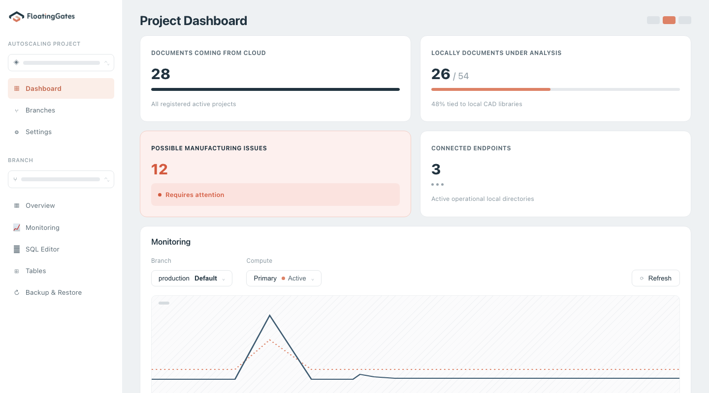
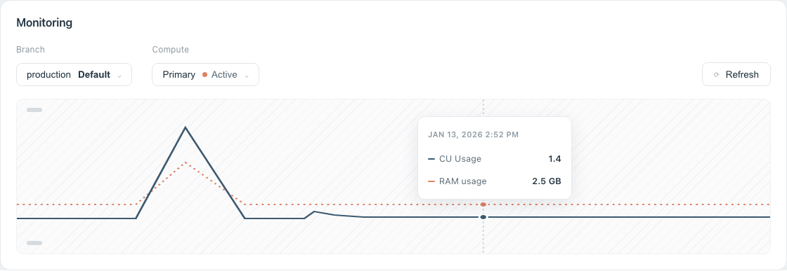

# FloatingGates Dashboard

A Vue 3 + Vite recreation of a project monitoring dashboard, themed for [FloatingGates](https://floating-gates.com/).

## Screenshots

**Dashboard overview**



**Interactive monitoring chart** — the tooltip, guide line, and data points follow your cursor



## Features

- Sidebar navigation with project/branch pickers and the FloatingGates brand lockup
- Stat cards summarizing documents, manufacturing issues, and connected endpoints
- A monitoring panel with an interactive usage chart — hover to see CU/RAM values and a timestamp follow your cursor

## Setup

### Prerequisites

- [Node.js](https://nodejs.org/) 18 or later
- npm (comes bundled with Node.js)

### Installation

```bash
git clone https://github.com/Manoob101/floating-gates-dashboard.git
cd floating-gates-dashboard
npm install
```

### Run the dev server

```bash
npm run dev
```

Vite will print a local URL (e.g. `http://localhost:5173`) — open it in your browser. The page hot-reloads as you edit files in `src/`.

### Build for production

```bash
npm run build
npm run preview
```

`npm run build` outputs a production bundle to `dist/`, and `npm run preview` serves that bundle locally so you can sanity-check it before deploying.

## Project structure

```
src/
  App.vue                       # Root component
  components/
    FloatingGatesDashboard.vue  # Main dashboard UI
  assets/
    floatinggates-logo.svg      # Brand lockup
  style.css                     # Global styles
```

## Tech stack

- [Vue 3](https://vuejs.org/) (`<script setup>` SFCs)
- [Vite](https://vite.dev/)
